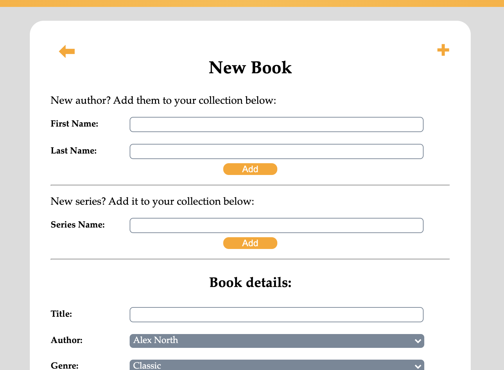
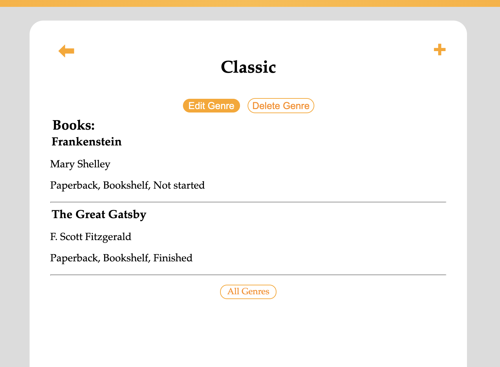

# Book Bank

## Prerequisites:
- gem install sinatra
- gem install sinatra-contrib

## Installing:
- Create a database called "library"
- Run the file "library.sql" against your new database
  - From the project folder: (psql -d library -f db/library.sql)
- Run the seeds file (if you want)
  - This will add a number of genres, books, reviews and tags
  - Run this first to get a feel for the application and try out the features
  - You can re-run the sql file to clear out the data or delete each item individually within the app
- Run app.rb
- Open http://localhost:4567 in your browser (Chrome tested and suggested)

## Testing:
- Specs files in models/specs (test initialize functions)
- If pry gem is installed, can test using the seeds file (uncomment pry('require') and binding.pry)

## Using the Application:
### General Navigation
- Use the bar at the top of the page to navigate through the application
- Each page of the application will have a "⬅" and a "+" button
  - "⬅" will take you back the the last page you visited
  - "+" will take you to the "New Book" page

### Bookshelf
- This will show books you have added with an ownership_status of "Bookshelf"
- When selecting a "view-by" option, this will filter by the selected parameters *only* for books that are on your "Bookshelf"

### Wishlist
- This will show all books you have added with an ownership_status of "Wishlist"

### New Book
- To add a new book, you will need to have the author and series (if applicable) already added to your library
- The "new book" page offers the option to add them at the top of the page for ease of use

### Admin
- You can use the admin page to customise your Authors, Genres, Formats, Series, Tags and Reviews
- Deleting an author, genre, format or series will delete all books marked with it
- When viewing a category, the books it has been applied to are listed below so you can see which books will be affected if you decide to delete or edit the name of that category

### Gimme
- The gimme page allows you to get a random book from your library based on certain conditions
- Gimme any book!
  - will take you to a completely random book in your "Bookshelf" or "Wishlist"
- I want to buy a book!
  - will take you to a completely random book in your "Wishlist"
  - you can narrow down your selection by providing an author, genre or tag
- I want to read a book!
  - will take you to a completely random book on your "Bookshelf" with a read status of "Not started"
  - you can narrow down your selection by providing an author, genre, format or tag
- I want to recommend a book!
  - will take you to a completely random book that you have rated 4+ stars
  - you can narrow down your selection by providing an author, genre or tag
